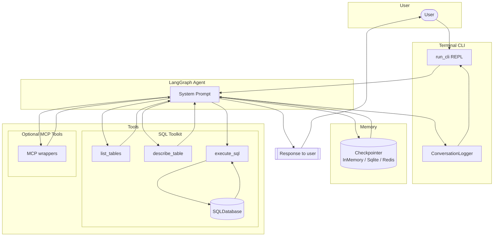

# Architecture Documentation

## System Overview

## Core Components

### Agent layer
- `build_agent_and_context` creates a LangGraph agent via `create_agent`, seeding it with the SQL database, optional MCP tools, and the chosen checkpointer.
- Conversation state lives in the LangGraph runtime; the CLI passes `thread_id` so checkpoints can be resumed across launches.
- The system prompt injects table schema, tone instructions, and optional structured output suffixes.

### Tooling

#### SQL toolkit (`src/sql_agent_tools.py`)
- `execute_sql`: read-only SELECT execution guarded by `_ensure_read_only`.
- `list_tables`: enumerates database tables.
- `describe_table`: PRAGMA-based schema inspection.

#### MCP toolkit (`src/sql_agent_mcp.py`)
- Loads Model Context Protocol servers defined in configuration files.
- Exposes both blocking (`load_mcp_tools`) and async (`aload_mcp_tools`) loaders so integrations can choose the right execution model.
- Merges MCP tools with the SQL toolkit when the runtime starts.

### Memory and state
- `InMemorySaver` is used by default for disposable sessions.
- `SqliteSaver` (requires `langgraph[sqlite]`) persists checkpoints to a user-provided path.
- `RedisSaver` (requires `langgraph[redis]` and `redis`) supports shared deployments via `--redis-url`.
- `--reset-memory` performs best-effort cleanup for SQLite and Redis backends before reloading the saver.

### Safety controls
- `_ensure_read_only` rejects blank statements, non-SELECT queries, and DML/DDL keywords.
- Structured prompts keep the agent focused on a single tool call per request.
- The CLI refuses to start if `.env` is missing, ensuring credentials are explicit.

### Tone and personalization
- The system prompt enforces concise English responses and encourages step-by-step reasoning.
- Thread identifiers allow the agent to reuse prior conversation context when checkpoints are enabled.

### Structured output
- Pydantic models (for example `InvoiceSummary`) describe JSON responses.
- `STRUCTURED_PROMPTS` maps schema keys to `(model, instructions, suffix)` tuples.
- Passing `--structured-output <key>` instructs the agent to respond with the chosen schema and the CLI validates the returned JSON before displaying it, surfacing any validation errors to the user.

## Extension Points

- Register additional Python tools and append them to the SQL toolkit.
- Provide an MCP configuration file via `--mcp-config` to attach external services.
- Implement custom middleware (logging, policy enforcement, analytics) and insert it into the LangGraph runtime.
- Extend structured outputs or adjust the default tone constants in `src/sql_agent.py`.

## Security Architecture

### Defense in depth
1. Query validation: rejects non-SELECT statements and DML/DDL keywords before they reach SQLite.
2. Database isolation: the runtime downloads the canonical Chinook snapshot if missing and enforces read-only access via input validation; the SQLite connection itself uses the standard driver, so file-level permissions can provide an additional read-only guarantee when needed.
3. Observability: optional JSONL logging (`--log-path`) captures every turn for auditing.

### Threat model
**Protected:** Accidental schema changes, obvious DML/DDL attempts, multi-statement payloads caught by the validator.  
**Not protected:** Long-running analytical queries, `SELECT *` statements without LIMIT (the agent may produce them), vulnerabilities in external MCP servers, model hallucinations.

## Database Schema

The agent targets the Chinook sample database.

**Catalog:** `Artist`, `Album`, `Track`, `Genre`, `MediaType`.  
**Customers & Sales:** `Customer`, `Employee`, `Invoice`, `InvoiceLine`.  
**Playlists:** `Playlist`, `PlaylistTrack`.

Key relationships mirror the Chinook ERD (for example an `Album` has many `Track` records). Typical analytical queries include tracking top selling tracks or customer lifetime value.

### Observability
- Optional conversation logger writes user and assistant payloads to JSONL.
- CLI flags allow token streaming, verbose event logs (`--event-stream`), or single-shot responses (`--no-stream`).
- LangSmith instrumentation can be added externally by configuring environment variables consumed by LangChain.
